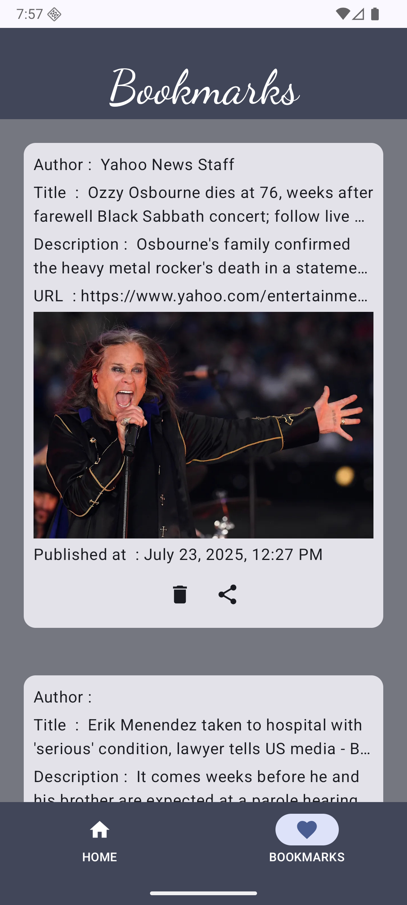

# 📰 NewsHub

NewsHub is a modern Android news app built with Jetpack Compose, MVVM architecture, and clean code principles. It fetches and displays top headlines based on user queries using the NewsAPI.

---

## ✨ Features

- 🔍 Search for latest news by keywords
- 🏷️ Bookmark articles locally using Room
- 📥 Offline access to saved articles
- 📑 Share articles via other apps
- ⚡ Uses Retrofit and Kotlin Coroutines for smooth network calls
- 🎨 Beautiful, Material 3 based UI with support for light/dark theme

---

## 📸 Screenshots

| Home Screen                          | Search Results                           | Bookmarks                                      |
|--------------------------------------|------------------------------------------|------------------------------------------------|
|  |  |  |

---

## 🧱 Architecture

- **MVVM** (Model-View-ViewModel)
- **Repository Pattern**
- **Unidirectional Data Flow** using `StateFlow`
- **Manual Dependency Injection** for ViewModel + Repository
- **Navigation Component** for screen transitions

---

## 🛠️ Tech Stack

- Jetpack Compose
- Retrofit
- Room
- Kotlin Coroutines
- StateFlow
- Navigation Compose
- Material 3 Design

---

## 🚀 Getting Started

1. Clone the repo:
   ```bash
   git clone https://github.com/SaifUllahAndDev/NewsHub.git
